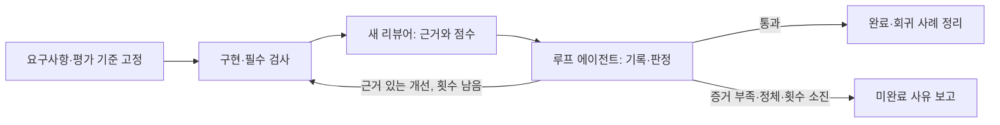

# AI Agent

**기획·구현·검증을 각자 맞는 모델에게 맡기고, 평가 근거를 다음 개선에 남기려고 만든 Claude Code / Codex 설정 모음이다.**

기획은 `high`, 구현과 단순 실행은 `medium`으로 둔다. 결과를 판단할 때는 별도의 최고 모델 서브에이전트를 `xhigh`로 실행한다. 작업한 에이전트의 설명을 그대로 믿는 대신, 요구사항과 실제 변경 파일부터 다시 확인하게 했다.

## 모델 배치

| 역할 | Claude Code | 추론 | Codex | 추론 |
| --- | --- | --- | --- | --- |
| 기획·심층 판단 | **Fable 5.1** · `claude-fable-5-1` | high | **Astra** · `gpt-6-astra` | high |
| 빌더 | Opus 5.0 · `claude-opus-5` | medium | Sol · `gpt-5.6-sol` | medium |
| 실행 보조 | Sonnet 5 · `claude-sonnet-5` | medium | Terra · `gpt-5.6-terra` | medium |
| 독립 검증 | **Fable 5.1** · 새 서브에이전트 | **xhigh** | **Astra** · 새 서브에이전트 | **xhigh** |
| 평가 기록·개선 제안 | Opus 5.0 · `ai-loop` | medium | Sol · `ai_loop` | medium |

검증의 “한 단계 높게”는 기획의 `high`를 기준으로 한다. 이 표는 이 저장소의 운영 선택이다. Opus 5.0은 사용자 표기이며 공식 모델 ID에는 `-0`이 붙지 않는다. 모델 지원 여부는 [공식 근거](docs/harness.md)와 실행 계정에서 확인한다. 이용할 수 없는 모델을 임의로 바꾸지 않는다.

## Claude Code 등록

Python 3.9 이상이 필요하다. 저장소를 받은 뒤 사용할 플랫폼만 설치한다.

```bash
git clone https://github.com/mingeonho1/ai-agent.git
cd ai-agent
python3 scripts/install.py claude --user
```

기본 경로는 Skill `~/.claude/skills/claude-agent-operations/`, 역할 5개 `~/.claude/agents/`다. 평가 루프 Skill `agent-evaluation-loop`도 함께 등록한다. `CLAUDE_CONFIG_DIR`가 지정돼 있으면 그 폴더 아래에 Skill·역할·선택형 훅 설정을 등록한다. 새 Claude Code 세션을 시작하고 `/claude-agent-operations`로 요청한다.

```bash
claude --model claude-fable-5-1 --effort high
```

`CLAUDE_CODE_EFFORT_LEVEL`이 설정돼 있으면 개별 에이전트의 effort를 덮어쓸 수 있다. 그 환경변수를 해제한 세션에서 이 역할 설정을 사용한다. Fable 5.1은 Claude Code 2.1.257 이상이 필요하다. [모델 설정](https://code.claude.com/docs/en/model-config)

## Codex 등록

같은 저장소에서 다음을 실행한다.

```bash
python3 scripts/install.py codex --user
codex --model gpt-6-astra -c 'model_reasoning_effort="high"'
```

Skill은 `~/.agents/skills/codex-agent-operations/`, 역할 5개는 `${CODEX_HOME:-~/.codex}/agents/`에 등록한다. 평가 루프 Skill `agent-evaluation-loop`도 함께 등록한다. 새 Codex 세션에서 `$codex-agent-operations`로 요청한다. 역할 파일의 모델·추론값이 하위 에이전트 실행에 적용되며, Skill만 복사하는 것으로 모델이 바뀌지는 않는다.

## 프로젝트별 등록

전역 설치 대신 대상 프로젝트에만 등록할 수도 있다. 두 플랫폼을 같은 프로젝트에 함께 설치할 수 있다.

```bash
python3 scripts/install.py claude --project /absolute/path/to/project
python3 scripts/install.py codex --project /absolute/path/to/project
```

| 플랫폼 | Skill | 서브에이전트 |
| --- | --- | --- |
| Claude Code | `.claude/skills/` | `.claude/agents/*.md` |
| Codex | `.agents/skills/` | `.codex/agents/*.toml` |

`--dry-run`으로 경로를 먼저 확인할 수 있다. 같은 파일은 재설치해도 그대로 두며, 다른 내용이 이미 있으면 덮어쓰지 않고 중단한다. 이전 버전의 `skills/claude-agent-operations`를 Codex에 설치했다면 새 Codex Skill을 쓰고, 기존 설치본은 해당 앱에서 비활성화하거나 정리한다.

## 필요한 하네스만

| Claude Code | Codex |
| --- | --- |
| 역할마다 `model`, `effort`, 필요한 `tools`를 가진 Markdown 에이전트 | 역할마다 `model`, `model_reasoning_effort`를 가진 TOML 에이전트 |
| `ai-reviewer`를 새 named subagent로 실행해 구현 대화와 분리 | `ai_reviewer`를 비상속 새 컨텍스트로 실행. API가 제공하면 `fork_turns="none"` 명시 |
| 작업 ID별 인수인계 문서, 선택형 압축 후 알림 훅 | 짧은 Skill 진입점과 필요한 참조만 읽는 방식, 기본 훅 추가 없음 |

두 플랫폼 모두 독립 작업은 병렬로 수행하고, 같은 파일은 한 명만 쓴다. 검증은 파일이 안정된 뒤 시작한다. 수정이 생기면 새 리뷰어가 영향 범위를 다시 검증한다. 비상속 컨텍스트를 확인할 수 없거나 별도 검증이 실행되지 않았으면 독립 검증 미완료로 보고한다. 리뷰어가 추가 실행 증거를 요구하면 실행 보조가 검사하고 리뷰어가 그 결과를 판단한다.

Claude에서 압축 후 인수인계를 자주 놓칠 때만 아래 옵션을 추가한다. 기존 `settings.json`의 다른 설정을 유지하며 `SessionStart`의 `compact` 이벤트에 짧은 안내를 더한다. 모델 호출이나 대화 전문 수집은 하지 않는다.

```bash
python3 scripts/install.py claude --user --with-context-hook
```

## 평가하고 개선하는 루프

`ai-loop` / `ai_loop`는 리뷰어의 평가를 기록하고 다음 수정 범위를 제안한다. 점수는 새 독립 리뷰어가 근거와 함께 매기고, 합산과 종료 판정은 Python 스크립트가 계산한다. 실제 수정과 재평가 호출은 메인 에이전트가 맡는다.



| 평가 항목 | 비중 | 확인하는 것 |
| --- | --- | --- |
| 의도 충족 | 30% | 사용자가 요청한 결과와 제약을 충족하는가 |
| 정확성 | 30% | 실제 동작과 사실이 맞는가 |
| 검증 근거 | 20% | 주장에 맞는 검사·실행 증거가 있는가 |
| 가독성 | 10% | 다음 사용자·작업자가 이해하고 쓸 수 있는가 |
| 효율 | 10% | 불필요한 변경·도구 호출·반복을 피했는가 |

각 항목은 관찰 조건이 있는 0–4점이다. 기본 통과 조건은 **총점 85점 이상, 모든 항목 3점 이상, 필수 검사 통과, 확인된 상·중 지적 없음, 독립 검증 확인**이다. 증거가 없으면 점수를 추정하지 않는다. 기준은 시작 전에 고정하고, 수정한다면 새 버전과 기준선을 만든다.

최초 평가를 포함해 최대 3회 실행한다. 같은 문제를 해결하지 못한 채 점수만 바뀌는 반복은 개선으로 보지 않는다. 이전 점수와 빌더의 설명은 새 리뷰어에게 전달하지 않고, 원래 요구사항·평가 기준·현재 산출물·검증 근거는 매번 제공한다. 작업별 기록은 `runs/<task-id>/`에 둔다. 검증된 교훈은 프로젝트의 `evals/lessons/`에 적용 조건·재현 방법·기대 결과와 함께 남기고, 다음 기획 때 관련 사례를 찾아 새 기준선의 검사 항목으로 반영한다.

이 배점과 횟수는 이 저장소의 기본값이다. 사람이 판정한 예시로 보정하기 전 점수는 임시 지표다. [루프 Skill·평가 기준·실행 스크립트](evaluation-loop/skills/agent-evaluation-loop/)에 구체적인 형식이 있다.

## 기획과 코드를 의심하는 레드팀

[red-team/](red-team/)은 별도로 설치한다. 기획의 전제와 코드의 실패 조건을 반대 입장에서 검토하고 **상·중·하 영향도**, 근거, 확신도, 재검증 방법을 반환한다. 기획 자체를 임의로 바꾸거나 의심을 확정 결함으로 바꾸지는 않는다.

```bash
python3 scripts/install.py claude --user --package red-team
python3 scripts/install.py codex --user --package red-team
```

Claude는 새 Fable 5.1 xhigh `ai-red-team`, Codex는 새 Astra xhigh `ai_red_team`을 사용한다. Claude에서는 `/adversarial-review`, Codex에서는 `$adversarial-review`로 요청한다. 운영 설정과 함께 설치하려면 `--package all`을 쓴다. `--project`와 `--dry-run`도 지원한다.

레드팀은 반례를 찾고, 최종 리뷰어는 그 근거를 판단한다. [Petri와 Bloom에서 참고한 범위](red-team/skills/adversarial-review/references/sources.md)를 명시했다. 이 저장소의 Skill은 두 프로젝트의 전체 프레임워크를 설치하지 않는다.

## 구성과 근거

- [Claude Skill](claude/skills/claude-agent-operations/SKILL.md) · [Claude 역할 설정](claude/agents/) · [선택형 훅](claude/hooks/compact-reminder.json)
- [Codex Skill](codex/skills/codex-agent-operations/SKILL.md) · [Codex 역할 설정](codex/agents/)
- [공식 문서에서 선택한 기법과 적용 범위](docs/harness.md)
- [평가 루프의 근거와 적용 범위](docs/evaluation.md)
- [경제 뉴스 카드 제작](https://github.com/mingeonho1/economic-news-card-skill)은 별도 저장소다.

토큰 절감률이나 품질 향상률은 아직 측정하지 않았다. 모델·추론·실행 시간·검증 결과를 작업별로 기록해 조정한다.
